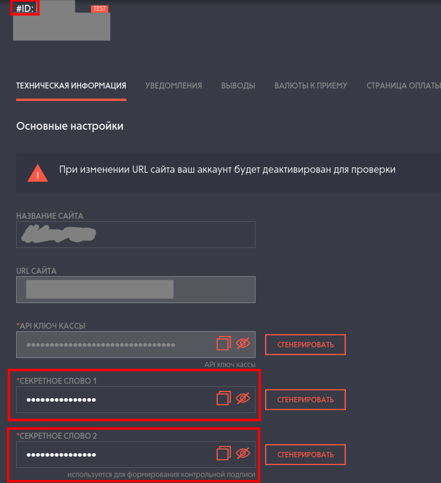
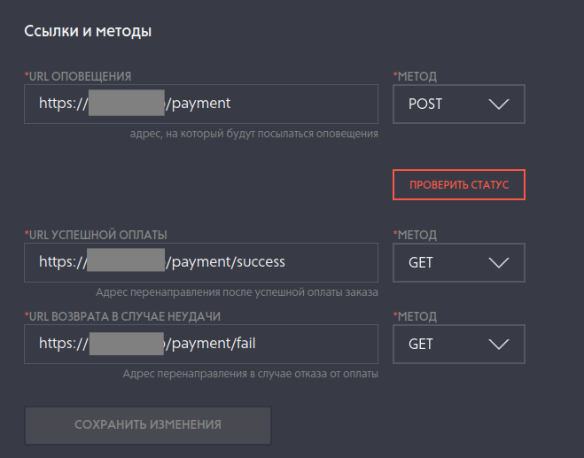
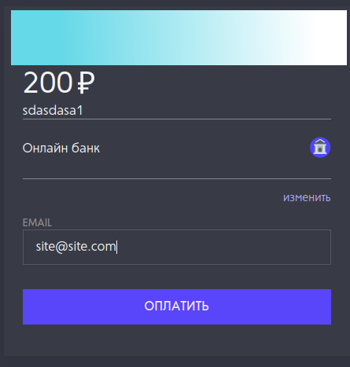
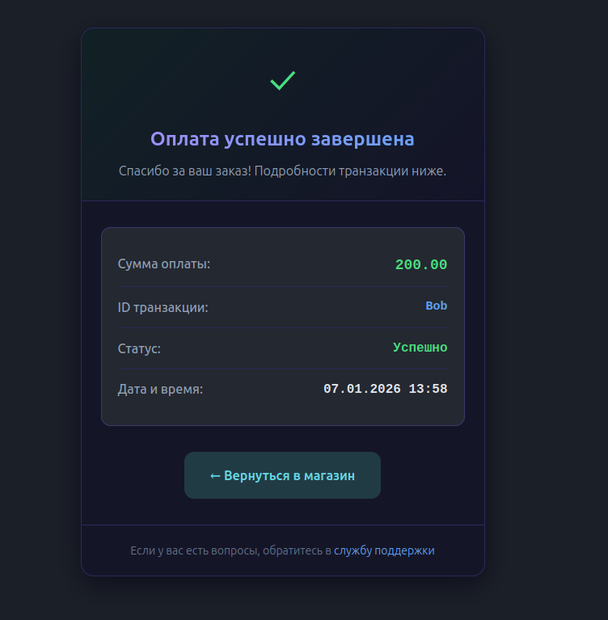

# Минимальная (тестовая) реализация взаимодействия с FreeKassa

## 1. Для запуска подготовьте .env.example
```BASH
cp .env.example .env
```

## 2. Зарегистрируйте кассу на [FreeKassa](https://freekassa.net)
На странице [Кассы](https://merchant.freekassa.net/settings) вам нужно найти:
- ID-кассы (цифры после #ID: )
- *Секретное слово 1
- *Секретное слово 2



Также рекомендую сверить [Доверенные адреса FreeKassa](https://docs.freekassa.net/#section/1.-Vvedenie/1.4.-Opoveshenie-o-platezhe)

```INI
FREE_KASSA_SHOP_ID= # ID-кассы
FREE_KASSA_ACCEPT_PORT= # Порт, на котором будет запущен наш сервер
FREE_KASSA_VALID_IPS="168.119.157.136,168.119.60.227,178.154.197.79,51.250.54.238" # 
FREE_KASSA_SECRET_WORD1=""# Секретное слово 1
FREE_KASSA_SECRET_WORD2=""# Секретное слово 2

SHOP_LINK=https://t.me/ # Ссылка на кнопке "Вернуться в магазин" на странице успешности оплаты
SUPPORT_LINK=https://t.me/ # Ссылка на кнопке "Обратиться в техподдержку" на странице успешности 

ORDER_ID=Bob # Идентификатор заказа, с которым создаст ссылку сервер
AMOUNT=2000  # Сумма оплаты
```

### 2.2 Настройка обратной связи с кассой
Для того, чтобы FreeKassa могла отправить HTTPS-запрос для оповещения об оплате, требуется домен, сертификат и настройка reverse-proxy.

### 2.2.1 Домен

Укажите в А-записи домена белый ip-адрес сервера, на котором будете запускать. Настройка будет зависеть от сервиса, где хостится ваш домен.

### 2.2.2 Настройка FreeKassa

На странице [Настройки кассы](https://merchant.freekassa.net/settings) настройте url для сообщений об оплате и url перехода для клиента. Для тестов, рекомендую использовать адреса.
```
https://<ваш.домен.com>/payment
https://<ваш.домен.com>/payment/success
https://<ваш.домен.com>/payment/fail
```


### 2.2.3 Получение сертификата

Один из самых простых и быстрых вариантов получения сертификата - это
[Let’s Encrypt](https://letsencrypt.org/)
Для этого просто используем команду ниже. Чтобы она выполнилась корректно, порты 80 и 443 на момент её выполнения не должны быть заняты другими сервисами. Можно настроить и на кастомном порту, но об этом советую почитать в интернете ;-)

```bash
sudo certbot certonly --standalone -d <ваш.домен.com>
```

Сертификат и ключи будут лежать по пути `/etc/letsencrypt/live/<ваш.домен.com>/*`

### 2.2.4 Reverse-Proxy
Вы можете использовать любой привычный вам Reverse-Proxy. Я приведу пример для nginx.

```nginx
server_names_hash_bucket_size 64;

upstream payment {
    server 127.0.0.1:<Ваш порт из .env FREE_KASSA_ACCEPT_PORT>;
}

ssl_protocols TLSv1.2 TLSv1.3;
ssl_ecdh_curve X25519:prime256v1:secp384r1;
ssl_ciphers ECDHE-ECDSA-AES128-GCM-SHA256:ECDHE-RSA-AES128-GCM-SHA256:ECDHE-ECDSA-AES256-GCM-SHA384:ECDHE-RSA-AES256-GCM-SHA384:ECDHE-ECDSA-CHACHA20-POLY1305:ECDHE-RSA-CHACHA20-POLY1305:DHE-RSA-AES128-GCM-SHA256:DHE-RSA-AES256-GCM-SHA384:DHE-RSA-CHACHA20-POLY1305;
ssl_prefer_server_ciphers on;
ssl_session_timeout 1d;
ssl_session_cache shared:MozSSL:10m;
ssl_session_tickets off;

server {
    server_name <ваш.домен.com>;
    listen unix:/dev/shm/nginx.sock ssl proxy_protocol;
    http2 on;

    ssl_certificate "/etc/letsencrypt/live/<ваш.домен.com>/fullchain.pem";
    ssl_certificate_key "/etc/letsencrypt/live/<ваш.домен.com>/privkey.pem";
    ssl_trusted_certificate "/etc/letsencrypt/live/<ваш.домен.com>/fullchain.pem";

    add_header Set-Cookie $set_cookie_header;

    location /payment {
        proxy_pass http://payment;
        proxy_set_header Host $host;
        proxy_set_header X-Real-IP $remote_addr;
        proxy_set_header X-Forwarded-For $proxy_add_x_forwarded_for;
        proxy_set_header X-Forwarded-Proto $scheme;
        proxy_read_timeout 120s;
        proxy_send_timeout 120s;
        proxy_buffering off;
        proxy_request_buffering off;
    }

    location @unauthorized {
        root /var/www/html;
        index index.html;
    }
}

```
## 3 Запуск: 
Заполним переменные окружения и запустим приложение:
```BASH
source .env
./FreeKassaTest
```
При запуске сервер выдаст ссылку на оплату:
```
root@pc:~/FreeKassa# ./FreeKassaTest 
[FreeKassa::Client] HTTP server started on port 1234
https://pay.fk.money/?m=1234&oa=2000.00&o=bob&s=ffffffffffffffffffffffffffffffff&currency=RUB
```
По ссылке клиент сможет произвести оплату удобным ему способом:



После успешной оплаты FreeKassa переаправит клиента на нашу страницу успешного пополнения:



В логе сервера же будет информация о прошедшей оплате:

```bash
Success payment
Wallet: Bob
Amount: 200
```
 